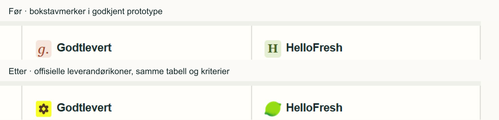

# Produksjonssprint – lanseringsrapport

**Dato: 28.09.2026. Beslutning: NO-GO for offentlig produksjonslansering.**

Den tekniske sprinten er gjennomført innenfor eksisterende konsept, leverandører og sider. Ingen redesign, nye innholdsseksjoner eller offentlige sider er lagt til. Faktiske GA4-/affiliate-verdier og logorettigheter er utsatt av eier. Bekreftede opplysninger om behandlingsansvarlig, hosting og lagring mangler også. Derfor er indeksering og statistikk fortsatt avslått, og leverandørknappene bruker vanlige offisielle lenker.

## P0/P1, rapportert før implementering

Ingen P0 avdekket i kontrollene.

| Prioritet | Funn og konsekvens | Status |
|---|---|---|
| P1 | Personvern var et prototypeutkast. Juridisk ansvarlig, driftsleverandører, lagring og overføringer var ikke bekreftet. | Implementasjonen og tekststrukturen er ferdigstilt; faktiske opplysninger må fylles inn og godkjennes før lansering. **Åpent.** |
| P1 | Reell GA4-ID og godkjente affiliate-lenker mangler. Ekte mottak, partnerdestinasjoner og attribusjon kan ikke verifiseres. | Sentral konfigurasjon, validering og lokal integrasjonstest er på plass. Reelle verdier er uttrykkelig utsatt. **Åpent.** |
| P1 | PRD-ens annonseforklaring før første kommersielle lenke var ufullstendig. | **Rettet.** «Annonse» med aktuelle partnernavn før sammenligning/resultat/leverandør-CTA, samt «Annonselenke» ved hver kommersielle knapp. |
| P1 | Produksjonskontrollen manglet lint og dekning av aktivt samtykke/affiliate-oppsett. | **Rettet lokalt.** Lint, typecheck, bygg, 19 tester, HTTP-kontroller og nettlesertester dokumentert nedenfor. Ekte verts-/kontokontroll gjenstår. |
| P1 | Under videre kontroll: utløpte utvalgstall kunne fortsatt gi en beskrivende fordel i prosa. | **Rettet.** Tekst og tabellbeskrivelser kontrollerer datoferskhet. |
| P1 | Samtykke/eventkontrakten manglet versjon/utløp og stramme parametervalg; selector-siden kunne bygge inn foreldede kommersielle flagg. | **Rettet.** Basic consent, utløp, tilbaketrekking, tillatte parametre, sanitert sideadresse og dynamiske flagg. |

Logorettighetene er et lanseringsrestpunkt, ikke en konklusjon om at bruken er ulovlig. Filene er hentet fra leverandørenes egne publiserte ressurser. Ingen P2/P3-ønsker er brukt til å utvide design eller innhold.

## Levert

- Alle 16 publiserte priseksempler og øvrige leverandørfakta kontrollert mot primærkilder; samme dato og produktverdier beholdt. Se [kildekontrollen](kildekontroll.md).
- Sentral affiliatekonfigurasjon, HTTPS/vertsvalidering, 302, noindex/nofollow-header, no-store, EPI med provider/placement og ingen åpne redirects. `/go/` er utenfor sitemap.
- Diskret annonseforklaring og riktig `rel` bare når en godkjent kommersiell URL er konfigurert.
- Samtykkestyrt GA4-klient og de sju bestilte eventtypene. Ingen Google-kode før aksept. Samtykke og avvisning utløper etter 180 dager, med ny forespørsel. Tilbaketrekking stopper måling og fjerner GA-cookies. Markedsføringssamtykke forblir avslått.
- Metode, om, kontakt, annonselenker og 404 kontrollert. Metodens kildeliste dekker alle faktakildene. E-post er fortsatt bare på kontaktsiden. Personvern er klargjort for reelle opplysninger, men kan ikke erklæres ferdig uten dem.
- Selvstendige titler/beskrivelser, én H1, canonical, Open Graph-bilde, Twitter-kort, WebPage/BreadcrumbList og globale WebSite/Organization-data. Ingen stjerner eller påstått produkttest i schema.
- Offisielle leverandørlogoer på leverandørsidene, favicons ved navn, eget Apple-ikon og PNG-favicon. Alle merkevarebilder serveres lokalt.
- Byggsperre ved indeksbar konfigurasjon uten påkrevde lanseringsverdier. `npm run check:launch` kontrollerer også faktadatoer og gir tydelig NO-GO når grunnlaget mangler.

## QA – faktisk gjennomført

| Kontroll | Resultat |
|---|---|
| `npm run lint` | Bestått, 0 advarsler |
| `npm run typecheck` | Bestått |
| `npm run build` | Bestått med Next.js 16.3.6, produksjonsbygg |
| `npm test` | 19/19 bestått; inkluderer 72 selector-kombinasjoner |
| HTTP-sjekk | Alle 11 eksisterende sider returnerer 200; ukjent side og ukjent leverandør returnerer 404 |
| Metadata/lenker | Én H1 per side, title, description, canonical, OG, Apple-ikon og gyldig JSON-LD kontrollert; alle interne lenker fra publikumssidene svarer 200 |
| Affiliate | Begge leverandører × tre plasseringer + ukjent plassering: 8 redirect-sjekker bestått med QA-konfigurasjon. EPI/noindex/no-store og avvisning av uønsket `url` bekreftet. Annonsetekst/rel bekreftet på fire inngangssider. |
| GA4-kontrakt | Alle sju bestilte eventtyper observert ved faktiske UI-handlinger mot **lokal simulator**, med tillatte provider/placement/answer-verdier. Se [eventbevis](events-browser-evidence.json) og [søsterklikk](sibling-event.json). |
| Samtykke | Ingen målescript ved nytt besøk/avvisning. Aksept gir consent→config→page_view. Tilbaketrekking fjerner script, også i andre åpne sider. Vanlig fane testet på siste bygg. |
| Mobil 360 / 390 / 430 | Ingen horisontal scrolling eller klipping i hovedreisen. 10 rader i utvidet tabell; 0 skjulte dataceller. Målt dokumentbredde lik tilgjengelig klientbredde. |
| Mobil selector | 2 × 3 pris → HelloFresh; 3 × 3 uten prioritet → Godtlevert; 4 × 4 pris → lik match uten fremhevet vinner; 7+ → ingen match og ingen bestillingsknapp |
| Desktop 1440 | Sammenligning 1180 px bred, samme hierarki og kriterier. Begge leverandørlogoer lastet med riktige naturlige bildestørrelser. |
| Tastatur/fokus | Skiplenke synlig med Tab; radioer med Space, neste/resultat med Enter; fokus flyttes til riktig steg-/resultatoverskrift. Ingen ekstra fokusflytting ved første radiosvar. |
| Kontrast | Brødtekst 14,18:1; sekundærtekst 5,76:1; primærknapp 6,86:1; aksentlenke/fokus mot bakgrunn 6,58:1; samtykketekst 14,80:1. Nye tekster bruker disse eksisterende verdiene. |
| Console/hydration | Ingen advarsler eller feil i vanlig produksjonsfane gjennom testet reise; ingen hydration-feil. Vanlig samtykkefane også uten feil. Se begrensning om iframe-verktøyet nedenfor. |
| Tomme/utløpte tilstander | Manglende pris, gammel pris/frakt, ukjente størrelser, ingen match, lik score og ugyldige/utløpte tilbud dekket av tester. «Ingen verifisert kampanje» kontrollert i nettleser. |
| Pris/kilde | Personer, middager, ukestotal, porsjonspris, frakt, adresseforbehold, kilder og faktisk kontrolldato kontrollert i sammenligning og selector-resultat. |
| Launch gate | **Forventet NO-GO**: reelle konfigurasjons-/personvernverdier og lanseringsbekreftelse mangler, indeksering er av. Dette er ikke en byggfeil. |

Sitemap har nøyaktig ni tillatte publikumssider i den sentrale listen: forside, begge leverandører, versus, metode, om, kontakt, personvern og annonselenker. Selector, designoversikt, go og 404 er utenfor. I nåværende forhåndsvisningsmodus er sitemap tomt og robots.txt sperrer crawling. Endelig indeksbar respons må kontrolleres på det faktiske domenet etter aktivering.

## Testbegrensninger

Mobiltesten brukte samme produksjonsbygde komponenter i 360/390/430 px iframes. Nettleseren reserverte 30 CSS-piksler til vertikal scrollbar, så innholdet ble også testet med klientbredder 330/360/400. Dette er ikke fysisk Safari-/Android-testing.

En isolert QA-kopi hadde SAMEORIGIN for egne iframes, en lokal GA-simulator og lokal sluttside for affiliate-klikk. Produksjon beholder `X-Frame-Options: DENY`, ekte Google-scriptadresse og sentrale `/go/`-lenker. QA-verdier/transport finnes ikke i produksjonskoden. Kopien er fjernet etter testen; gjenopprettbar testoppskrift er [prepare-qa.cjs](prepare-qa.cjs).

Instrumenterte mobilrammer logget to MutationObserver-feil under omlasting. Egen appkode bruker ikke MutationObserver; feilen ble ikke observert ved samme aksept/tilbaketrekking i vanlig fane. Dette er en begrensning i nettleser-/iframe-testen, ikke dokumentasjon på at alle nettlesere er feilfrie. Virkelig GA4-nettverk/DebugView, faktiske partnerdestinasjoner, cookieoppførsel fra Googles script og fysisk mobil er fortsatt ikke verifisert.

ESLint 9.39.5 er låst som utviklingsverktøy fordi Nexts React-regler feiler med ESLint 10. Runtimepakken er ikke endret av dette. npm rapporterte 0 kjente sårbarheter ved installasjonen. Ingen verktøymigrering er tatt inn i sprinten.

## Restpunkter før GO

1. **Eier, utsatt:** reell GA4-ID og begge godkjente Adtraction-lenker; rettigheter og eventuelle programkrav for partnerlogoer.
2. **Eier/drift:** juridisk navn/org.nr., hosting og e-postleverandør, databehandlere, logg-/e-post-/GA-lagring, behandlingsgrunnlag og eventuelle overføringer. Fyll dette i den klargjorte personvernteksten.
3. **Etter konfigurering:** bekreft ekte affiliate-destinasjoner og EPI; GA4-administrasjon, DebugView og nettverk før/etter samtykke; test fysisk mobil i valgt verts forhåndsvisning.
4. **Før offentlig åpning:** TLS/DNS/www-videresending, ferske leverandørdata dersom lanseringen utsettes, lanseringsbekreftelse, nytt indeksbart bygg og endelig robots/sitemap/canonical-kontroll på Middagskasser.no.

Detaljert oppsett og aktiveringsrekkefølge: [produksjonsoppsett](produksjonsoppsett.md). Ingen publisering, kontoaktivering eller e-postutsending er utført.

## Visuelt bevis

Kun bestilte merkevarefiler og nødvendige annonse-/samtykketekster er lagt til. Tabellens størrelse, kriterier, sider og konsept er beholdt.

- [Desktop, endelig sammenligning](desktop-comparison-final.png)
- [Mobil sammenligning med aktiv QA-konfigurasjon](mobile-comparison.png)
- [Mobil samtykke med QA-konfigurasjon](mobile-consent.png)
- [Tre selector-resultater](mobile-results.png)
- [Maskinlesbare resultatobservasjoner](selector-browser-evidence.json)

**Konklusjon: NO-GO for produksjonslansering nå. Teknisk klargjøring er levert; de eksplisitte restpunktene må lukkes før GO.**
