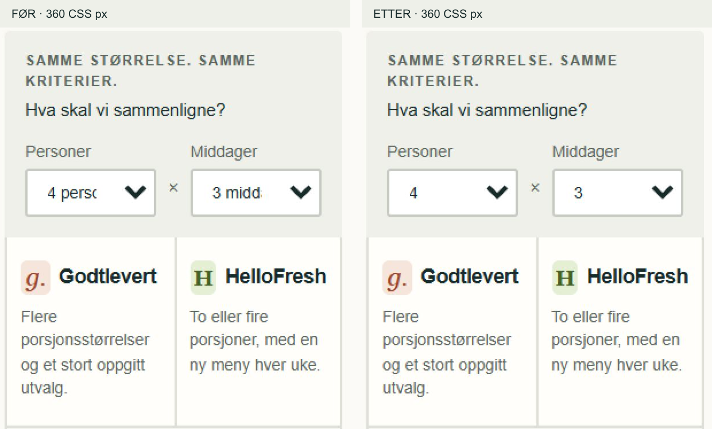
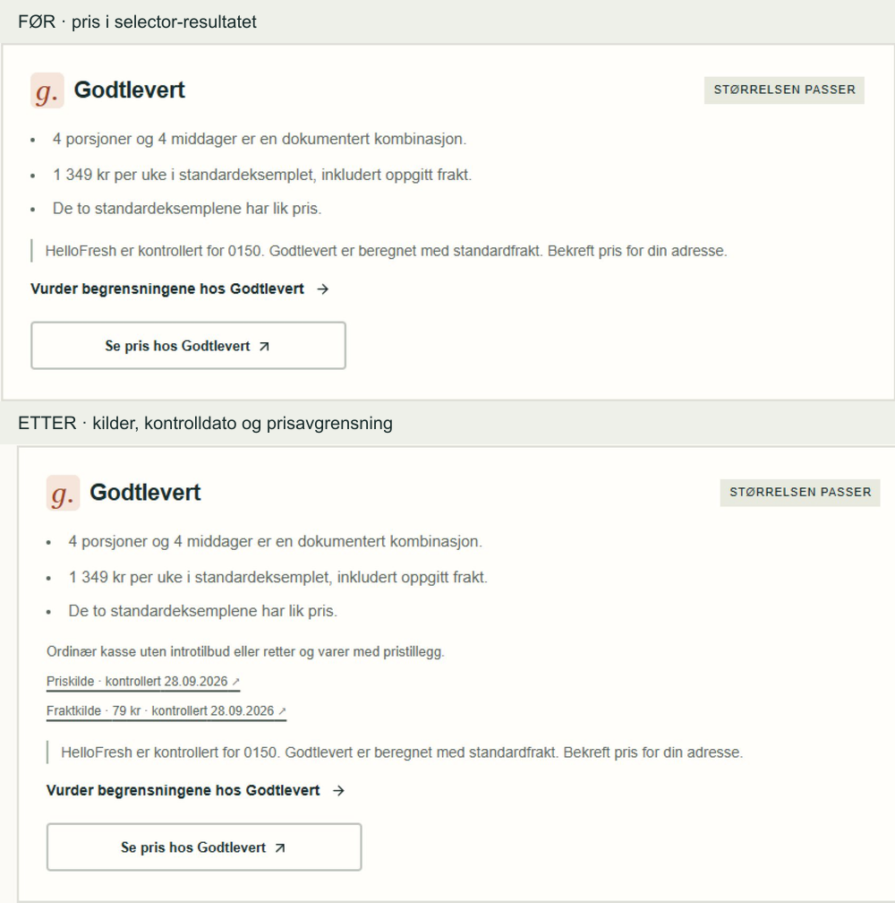

# Avgrenset UX/QA-sprint · 28.09.2026

Tre tydelige P2-funn er rettet. Ingen P1-funn ble påvist. Konsept, routes, innholdsseksjoner, sammenligningskriterier og rangering er uendret. Funnene ble rapportert i samtalen før produktkoden ble endret.

## Funn og beslutninger

| Prioritet | Funn og begrunnelse | Tiltak |
|---|---|---|
| P1 | Ingen kritisk hindring påvist i den testede hovedreisen. | Ingen. |
| P2 | Valgtekstene «4 personer» og «3 middager» ble klippet i smale sammenligningsfiltre. Dette gjør valgt pakke vanskeligere å lese. | Alternativene viser nå tall. De synlige og programmatisk tilknyttede etikettene «Personer» og «Middager» beholdes. |
| P2 | Selector-resultatet viste beløp og prisforskjell uten direkte kilde, kontrolldato eller avgrensning mot introtilbud og pristillegg. Brukeren kunne gå videre til leverandør uten dette grunnlaget. | Begge eksisterende resultatkort viser pris- og fraktkilde med faktisk lagret kontrolldato, fraktbeløp og prisavgrensning. Visningen bruker samme gyldige pristilbud som resultatberegningen. |
| P2 | Utvidelsesknappen rapporterte ikke åpnet/lukket-status til hjelpemidler. | `aria-expanded` følger tilstanden, og `aria-controls` peker til sammenligningstabellen. Verifisert med Enter både ved åpning og lukking. |
| P3 | En større desktopvariant kan være et alternativ, men det ble ikke påvist en svakhet som begrunner endringen. Tabellen er 1180 CSS px ved 1440 px viewport, omtrent 82 % av bredden. Overskrift, leverandørnavn og prisrad gir tydelig hierarki. | Ingen alternativ variant eller breddeendring. |
| P3 | Illustrasjonsmerkingen er allerede avgrenset til bildets nedre hjørne, med 12 px tekst og mørk bakgrunn. Ytterligere nedtoning har ingen påvist UX-gevinst i denne testen. | Beholdt plassering og tekst. |

## Mobilmatrise

Eksakt `innerWidth` ble kontrollert i nettleseren. Nettleserens klassiske vertikale rullefelt tok 30 CSS px; innholdet ble derfor også prøvd under trangere forhold enn mobilnettlesere med overliggende rullefelt.

| Viewport | Tilgjengelig innholdsbredde | Dokumentets scrollWidth | Resultat etter retting |
|---:|---:|---:|---|
| 360 px | 330 px | 330 px | Ingen horisontal scrolling. Hele filterverdien synlig. Ingen klippede eller skjulte leverandørceller. |
| 390 px | 360 px | 360 px | Samme resultat. |
| 430 px | 400 px | 400 px | Samme resultat. |

Både standardvisning og utvidet visning ble kontrollert ved alle tre bredder. Samme fem kriterier vises først og samme åtte etter utvidelse. Begge leverandører står side om side. Valg av tre personer viser «Pris må sjekkes» hos Godtlevert og «Størrelsen er ikke oppgitt» hos HelloFresh; ingen pris blir konstruert.

## Hero og selector

| Handling / svar | Observert resultat |
|---|---|
| «Hjelp oss å velge» | Åpner første selectorspørsmål direkte, uten en ekstra startknapp. Også kontrollert ved 360 px. |
| «Sammenlign selv» | Går til `#sammenligning`. Neste Tab treffer feltet «Personer». |
| 2 porsjoner × 3 middager, lavere normalpris | HelloFresh: 849 kr mot 939 kr i standardeksemplet, 90 kr lavere. Bare HelloFresh matcher prisprioriteringen. |
| 3 porsjoner × 3 middager, ingen klar prioritet | Godtlevert har den valgte kassestørrelsen. HelloFresh viser ingen eksakt størrelsesmatch og ingen kjøps-CTA for denne størrelsen. |
| 4 porsjoner × 4 middager, lavere normalpris | Begge 1349 kr. «Begge kan være aktuelle for dere», like merker og ingen fremhevet vinner. Kontrollert igjen i produksjonsbygget etter endring. |

Forskjellen mellom hero-valgene vurderes som forståelig: aktiv hjelp/tre spørsmål versus egen sammenligning, med henholdsvis høyrepil og nedpil. Dette er en faglig UI-vurdering, ikke en brukerstudie.

## Prisaudit

Hovedtabellen viser antall personer og middager både i etiketter og ved prisraden. Beløpet er merket per uke, med pris per porsjon under. Standardeksemplet 4 × 3 gjelder 12 porsjoner over tre middager. Det er ingen pris for en hel måned eller bare én middag.

Frakt er eksplisitt oppgitt som inkludert 79 kr. Godtleverts total er et beregnet standardeksempel; adresseprisen er ikke bekreftet. HelloFresh-eksemplet er kontrollert for postnummer 0150. Disse forbeholdene står ved prisene. Pris- og fraktkilder er lenket.

Datoen **28.09.2026** kommer fra det eksisterende, dokumenterte leverandørgrunnlaget i `docs/research-leverandorer.md`. Denne sprinten kontrollerte at datoen presenteres riktig; prisene ble ikke innhentet på nytt. Ingen dato ble erstattet med automatisk «i dag». Selector viser nå de samme lagrede kontrolldatoene. Manglende/utløpte priser gir verken prispoeng eller kildeblokken for et gjeldende prisresultat.

## Tastatur, kontrast og CTA

- Tab-rekkefølge gjennom logo, hovedmeny og begge hero-valg er logisk og har synlig fokus.
- Enter aktiverer sammenligningslenken; neste Tab går til første filter. Native nedtrekksfelt beholder tilgjengelige etiketter.
- Space velger radioalternativer; Enter går videre. Fokus flyttes til overskriften ved hvert spørsmål og ved resultatet.
- Åpne/lukke-knappen beholder fokus og rapporterer `true`/`false` korrekt.
- Resultatets leverandør-CTA er tastaturtilgjengelig med synlig fokus og riktig `/go/...`-adresse.
- HTTP-testen bekreftet at begge leverandør-CTA-er videresender til korrekt offisiell adresse. Ingen bestilling ble gjennomført.
- Beregnet kontrast: hovedtekst mot bakgrunn **14,18:1**, sekundærtekst **5,76:1**, sekundærtekst på lys grønn bakgrunn **5,23:1**, hvit knappetekst mot blått **6,86:1**. Blå fokusmarkering mot hvitt: **6,86:1**.
- Ingen konsollfeil observert i den siste produksjonsvisningen.

## Verifikasjon og avgrensning

`npm run test`: **10 av 10 bestått**, inkludert lik pris, utløpte/manglende priser, manglende frakt og at kommersiell informasjon ikke endrer resultatet. Eksisterende tester ble utvidet med kontroll av kildegrunnlagets dato og fravær av kildegrunnlag ved ugyldig prissammenligning.

`npm run build`: **bestått**, inkludert TypeScript. `node tests/http-smoke.mjs`: **bestått**, 11 sider, 404, begge videresendinger og eksisterende metadataregler.

Mobiltestene ble kjørt som tre innrammede Chromium-visninger av en isolert lokal kopi med samme app-, komponent-, data- og CSS-filer. Dette var nødvendig fordi testnettleserens zoom/minimumsbredde hindret direkte innstilling av de minste breddene. Bare kopien tillot innramming fra samme origin. Kopien og de midlertidige QA-serverne er fjernet/stoppet; prototypens `X-Frame-Options: DENY` er beholdt. Ingen QA-route er lagt til prototypen.

Dette er responsiv nettleser-QA, ikke testing på fysiske iOS-/Android-enheter eller en full skjermleserrevisjon. Tilgjengelighetsfunnene er kontrollert gjennom tastatur, fokus og DOM/ARIA.

## Før og etter

Utsnitt fra faktiske skjermbilder. Bare beskjæring, skalering og forklarende etiketter er lagt til.

Hele mobilvisningen finnes i `before-mobile-comparison.png` og `after-mobile-comparison.png`. Utvidet visning finnes i `after-mobile-expanded.png`. Selectorens større utsnitt finnes i `before-selector-price.png` og `after-selector-price.png`.
